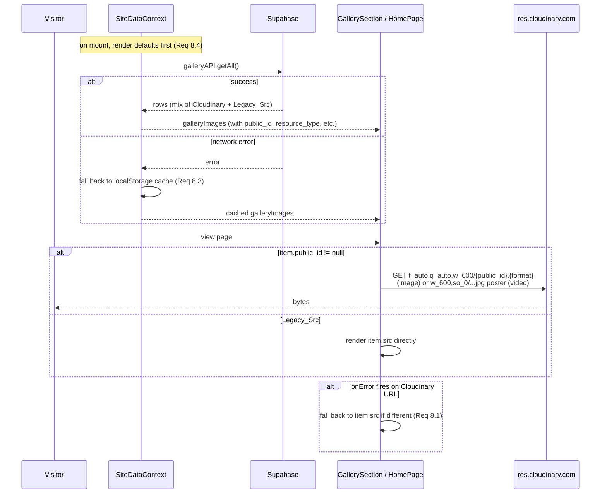
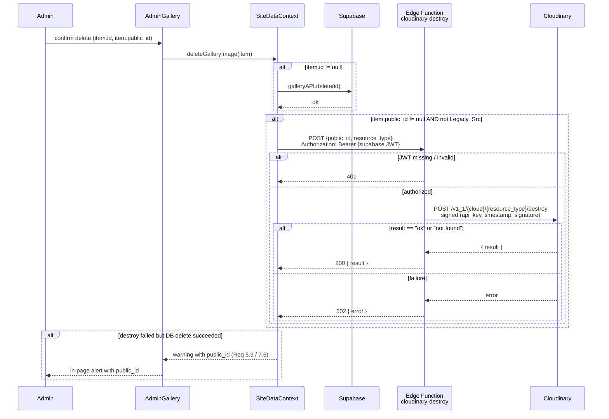

# Design Document

## Overview

This feature replaces the localStorage/base64 gallery media path with a Cloudinary-backed pipeline. The browser uploads gallery images and videos directly to Cloudinary using an unsigned preset; Supabase stores only the resulting metadata (`public_id`, `secure_url`, `resource_type`, `format`, `width`, `height`, `bytes`, `duration`); the public site renders from Supabase using transformed Cloudinary delivery URLs; and a Supabase Edge Function performs signed `destroy` calls so deletes propagate to Cloudinary without ever exposing `Cloudinary_API_Secret` to the client.

The design is constrained by the existing stack — React 18 + Vite, Supabase (Postgres + Auth + Edge Functions), and a static `public/images/gallery/` directory of seeded JPGs that must keep working as `Legacy_Src` rows. There is no custom backend; the only server-side code introduced is one Edge Function. All five Cloudinary-specific concerns (configuration, upload, persistence, deletion, public render) and the two operational concerns (admin feedback, fallbacks) are handled within this scope.

The design also fixes the latent bug called out in Requirement 4: today, `AdminGallery` assigns string ids of the form `'img-' + Date.now()` to new items, then `SiteDataContext.updateGalleryImages` checks `if (img.id) { update(...) } else { create(...) }` — a string id is truthy, so the UPDATE branch always runs against an integer SERIAL primary key, the row is silently a no-op (or 0-row update), and the admin sees a green "Saved" while only `localStorage` actually changed. Errors from `galleryAPI.create/update/delete` are swallowed because those helpers `console.error` and `return null` instead of throwing.

This design references requirements as **Req X.Y** throughout (e.g. **Req 4.1** is Requirement 4 acceptance criterion 1).

## Architecture

### High-level component diagram

```mermaid
flowchart LR
  subgraph Browser
    AG[AdminGallery.jsx]
    GS[GallerySection.jsx]
    HP[HomePage.jsx]
    GP[GalleryPage.jsx]
    SDC[SiteDataContext.jsx]
    US[lib/cloudinary.js<br/>Upload_Service + URL builders]
    SB[lib/supabase.js<br/>galleryAPI]
  end

  subgraph Cloudinary
    UPL[/v1_1/{cloud}/image/upload<br/>/v1_1/{cloud}/video/upload/]
    CDN[res.cloudinary.com<br/>delivery + transforms]
    DST[/v1_1/{cloud}/{type}/destroy/]
  end

  subgraph Supabase
    PG[(gallery_images table)]
    EF[Edge Function<br/>cloudinary-destroy]
    AUTH[Supabase Auth JWT]
  end

  AG -->|file| US
  US -->|multipart POST<br/>upload_preset, folder| UPL
  UPL -->|Cloudinary_Asset JSON| US
  US -->|Media_Reference| AG
  AG -->|images array| SDC
  SDC -->|insert/update| SB
  SB <--> PG

  AG -->|delete id| SDC
  SDC -->|galleryAPI.delete| SB
  SDC -->|fetch with JWT<br/>{public_id, resource_type}| EF
  EF -->|signed POST| DST
  EF -->|JSON result| SDC
  AUTH --- EF

  PG -->|getAll| SDC
  SDC --> GS
  SDC --> HP
  SDC --> GP
  GS -->|Cloudinary URL with f_auto,q_auto,w_*| CDN
  HP -->|Cloudinary URL w_600| CDN
  GP --> GS
```

### Three flows

**1. Admin upload flow** (Req 1, Req 2, Req 4, Req 7).

```mermaid
sequenceDiagram
  participant A as Admin
  participant AG as AdminGallery
  participant US as Upload_Service
  participant CL as Cloudinary
  participant SDC as SiteDataContext
  participant DB as Supabase

  A->>AG: choose file
  AG->>US: validateGalleryFile(file)
  alt invalid
    US-->>AG: throws (size/format/MIME)
    AG-->>A: alert region: error
  else valid
    AG->>US: uploadGalleryMedia(file, onProgress)
    loop XHR progress events
      US-->>AG: onProgress(fraction 0..1)
      AG-->>A: progress bar
    end
    US->>CL: POST /v1_1/{cloud}/{image|video}/upload<br/>file, upload_preset, folder=tedxdutse/gallery
    CL-->>US: Cloudinary_Asset JSON
    US-->>AG: Media_Reference
    AG->>AG: append item with id=null + Media_Reference fields
  end
  A->>AG: click Save Gallery
  AG->>SDC: updateGalleryImages(items, removedItems)
  SDC->>DB: galleryAPI.create / galleryAPI.update per item
  alt all rows persisted
    DB-->>SDC: rows with integer id
    SDC-->>AG: resolves with snapshot
    AG-->>A: button -> success
  else any failure
    DB-->>SDC: error
    SDC-->>AG: rejects with Error
    AG-->>A: alert region: message; button -> idle
  end
```

**2. Public render flow** (Req 6, Req 8, Req 9).



**3. Delete flow** (Req 5, Req 7).



### Module boundaries

| Module | Responsibility | Why |
|---|---|---|
| `src/lib/cloudinary.js` | Upload_Service + Cloudinary URL builders. No DOM, no Supabase. | Pure module so it can be unit/property-tested without React. |
| `src/lib/supabase.js` | Add Cloudinary metadata fields to `galleryAPI`; throw on Supabase errors. | Single place that knows the DB column names. |
| `src/context/SiteDataContext.jsx` | Orchestrate insert vs update vs delete; call Edge Function; throw to admin UI. | Already the persistence orchestrator. |
| `src/pages/admin/AdminGallery.jsx` | UI state machine; alert region; progress; track removedItems. | Only place that can render admin alerts. |
| `src/components/sections/GallerySection.jsx` + `src/pages/HomePage.jsx` | Render with Cloudinary URL builders + onError fallback. | Public render; HomePage shares the same rules per Req 6.5. |
| `supabase/functions/cloudinary-destroy/index.ts` | Sign and forward Cloudinary destroy; auth via Supabase JWT. | Only place `Cloudinary_API_Secret` lives. |
| `supabase/migrations/00003_cloudinary_gallery.sql` | Idempotent schema migration. | Add columns without breaking legacy rows. |
| `src/components/shared/Alert.jsx` | In-page alert region with `role="alert"`. | Replaces `window.alert` per Req 7.7. |

## Components and Interfaces

### `src/lib/cloudinary.js` — Upload_Service and URL builders

This module is the only client-facing surface for Cloudinary. It reads `VITE_CLOUDINARY_CLOUD_NAME` and `VITE_CLOUDINARY_UPLOAD_PRESET` from `import.meta.env`. It does not import `VITE_CLOUDINARY_API_KEY` (that key is only relevant inside the Edge Function for signing destroy; the upload uses an unsigned preset and does not need a key). It does not reference any name resembling `api_secret` (Req 1.5).

```js
// Constants exported for tests and config docs
export const ALLOWED_IMAGE_FORMATS = ['jpg', 'jpeg', 'png', 'webp', 'avif', 'gif'];
export const ALLOWED_VIDEO_FORMATS = ['mp4', 'webm', 'mov'];
export const IMAGE_SIZE_LIMIT = 10 * 1024 * 1024;   // 10 MB (Req 2.10)
export const VIDEO_SIZE_LIMIT = 100 * 1024 * 1024;  // 100 MB (Req 2.11)
export const THUMBNAIL_WIDTH = 600;                  // Req 6.1, 6.4, 6.5
export const LIGHTBOX_WIDTH = 1600;                  // Req 6.2
export const RESPONSIVE_WIDTHS = [400, 800, 1200];   // Req 6.8
export const CLOUDINARY_FOLDER = 'tedxdutse/gallery';

// Reads VITE_CLOUDINARY_CLOUD_NAME / VITE_CLOUDINARY_UPLOAD_PRESET (Req 1.1, 1.2)
// Throws naming the missing var (Req 1.3, 1.4)
function getConfig(): { cloudName: string; uploadPreset: string };

/**
 * Pre-flight validation. Pure synchronous function so it can be property-tested.
 * Returns { resourceType: 'image' | 'video', extension: string }.
 * Throws Error with message containing the offending value when invalid.
 *
 * Validates:
 *   - file.type starts with image/ or video/  (Req 2.7)
 *   - extension is in the allow-list for the chosen kind  (Req 2.8, 2.9)
 *   - file.size <= the kind's limit  (Req 2.10, 2.11)
 */
export function validateGalleryFile(file: File): { resourceType: 'image' | 'video'; extension: string };

/**
 * Direct browser upload. Implemented with XMLHttpRequest because fetch() does not
 * report upload progress. Returns a Media_Reference.
 *
 * onProgress receives a fraction in [0, 1] computed from event.loaded / event.total
 * (Req 2.6). When event.lengthComputable is false the function emits no progress
 * events but still resolves on completion.
 *
 * Rejects with Error whose message includes:
 *   - the HTTP status and Cloudinary error.message on non-2xx (Req 2.5)
 *   - validateGalleryFile's message on pre-flight failure (Req 2.7-2.11)
 *
 * The folder field is always 'tedxdutse/gallery' (Req 2.1).
 */
export function uploadGalleryMedia(
  file: File,
  onProgress?: (fraction: number) => void
): Promise<MediaReference>;

export type MediaReference = {
  public_id: string;        // Cloudinary public_id (Req 2.4, 3.1)
  secure_url: string;       // https URL of the asset (Req 2.4, 3.5)
  resource_type: 'image' | 'video';  // Req 2.2, 2.3, 3.2
  format: string;           // e.g. 'jpg', 'mp4'
  width: number;
  height: number;
  bytes: number;
  duration: number | null;  // null when Cloudinary returned no duration (Req 2.4)
};

// URL builders. All return strings; do not perform network I/O.

// https://res.cloudinary.com/{cloud}/image/upload/f_auto,q_auto,w_{width}/{public_id}.{format}
// (Req 6.1, 6.2, 6.5, 6.7)
export function buildImageUrl(input: { publicId: string; format: string; width: number }): string;

// https://res.cloudinary.com/{cloud}/video/upload/f_auto,q_auto/{public_id}.{format}
// (Req 6.3, 6.7)
export function buildVideoUrl(input: { publicId: string; format: string }): string;

// https://res.cloudinary.com/{cloud}/video/upload/f_auto,q_auto,w_{width},so_0/{public_id}.jpg
// (Req 6.4, 6.5, 6.7)
export function buildVideoPosterUrl(input: { publicId: string; width?: number }): string;

// Returns "url1 400w, url2 800w, url3 1200w" using buildImageUrl per width.
// (Req 6.8)
export function buildSrcSet(input: { publicId: string; format: string }): string;
```

Design decisions:

- **XMLHttpRequest, not `fetch`**: Req 2.6 requires a progress fraction from `loaded / total`; the Streams API on `fetch` request bodies is not supported in Safari and isn't necessary when XHR's `upload.onprogress` already gives the exact event. (Cited Cloudinary direct upload pattern: <https://cloudinary.com/documentation/upload_images#direct_call_to_the_rest_api>.)
- **Unsigned preset only**: Per Req 1.5/1.6/10.1, the browser never includes `api_key`, `timestamp`, or `signature`. The Cloudinary preset itself enforces folder, allowed formats, and size limits as a defence-in-depth layer (Req 10.1).
- **No SDK**: We do not pull in `cloudinary-core` or `@cloudinary/url-gen`. The URL builders here cover exactly the four URL shapes Req 6 demands; the surface stays small, the bundle stays small, and Req 6.7 ("only the transformation parameters listed") is enforced by construction.
- **Validation is separate from upload**: `validateGalleryFile` is exported so admin code can short-circuit before showing a progress bar, and so it can be property-tested without mocking XHR.

### `src/lib/supabase.js` — `galleryAPI` changes

`galleryAPI.create`, `update`, `delete`, and `getAll` are the only existing helpers we touch. Two changes:

1. Accept and project the new columns (`public_id`, `resource_type`, `format`, `width`, `height`, `bytes`, `duration`) in `create` and `update` payloads and in the row shape returned by `getAll`.
2. Stop swallowing errors. Today they `console.error` and `return null`. New contract: throw a typed `Error` whose message includes the Supabase error message and code (Req 4.6). This is the change `SiteDataContext` relies on to surface failures to the admin UI (Req 4.5, Req 7.3).

```js
export const galleryAPI = {
  // Returns row[]. Rejects with Error('gallery getAll failed: <code> <message>') on error.
  // (Used by Req 8.3 fallback — caller catches and falls back.)
  async getAll(): Promise<GalleryRow[]>;

  // Inserts a new row. Returns the inserted row including the integer id.
  // Rejects with Error on Supabase error (Req 4.6).
  async create(row: Omit<GalleryRow, 'id' | 'created_at' | 'updated_at'>): Promise<GalleryRow>;

  // Updates by integer id. Rejects with Error on Supabase error (Req 4.6).
  async update(id: number, updates: Partial<GalleryRow>): Promise<GalleryRow>;

  // Deletes by integer id. Rejects with Error on Supabase error (Req 4.6).
  async delete(id: number): Promise<void>;
};

type GalleryRow = {
  id: number;                              // SERIAL PRIMARY KEY (Req 3.4)
  src: string;                             // legacy or Cloudinary secure_url (Req 3.5)
  alt: string | null;
  orientation: 'landscape' | 'portrait' | null;
  order_index: number | null;
  public_id: string | null;                // null for Legacy_Src (Req 3.6, Req 9.1)
  resource_type: 'image' | 'video' | null; // (Req 3.2)
  format: string | null;
  width: number | null;
  height: number | null;
  bytes: number | null;
  duration: number | null;                 // (Req 3.3)
  created_at: string;
  updated_at: string;
};
```

The other API helpers in `supabase.js` (speakers, schedule, etc.) keep their existing "swallow and return null" behaviour for this feature. Changing them is out of scope for `cloudinary-gallery-media`.

### `src/context/SiteDataContext.jsx` — corrected gallery flow

The existing context exposes `updateGalleryImages(newImages)` and `deleteGalleryImage(imageId)`. Both are rewritten:

```js
/**
 * Persists the full gallery in one transaction-of-best-effort:
 *
 *   1. Snapshot the current in-memory list (for rollback on failure).
 *   2. For each item in `newImages`:
 *        - if item.id is a positive integer that exists in the snapshot,
 *          call galleryAPI.update(item.id, { ...payload, order_index: i })  (Req 4.2)
 *        - else (item.id is null or undefined),
 *          call galleryAPI.create({ ...payload, order_index: i })  (Req 4.1)
 *          and replace item.id with the integer Supabase returned.
 *   3. For each id in `removedItems`, call galleryAPI.delete(id).
 *      For each public_id in `removedItems` whose row was a Cloudinary upload,
 *      invoke Delete_Service via fetchEdgeFunction('cloudinary-destroy', ...).
 *   4. After all DB writes succeed, set state to the result array (with
 *      DB-assigned ids) and write to localStorage. Resolve with the result.
 *      (Req 4.7)
 *
 * On any DB error: roll the in-memory state back to the snapshot, do not write
 * to localStorage, and reject the returned Promise with the Supabase error
 * (Req 4.5). The error propagates to AdminGallery's await (Req 7.3).
 *
 * Edge Function rejections are non-fatal for the row delete: the row is already
 * gone from Supabase, so the public site stops showing it; we resolve with a
 * `cloudinaryWarnings` array of `{ public_id, message }` so AdminGallery can
 * show the manual-cleanup warning (Req 5.9, Req 7.6).
 *
 * `item.id` MUST be a positive integer (assigned by Supabase) or null/undefined.
 * String ids of the form 'img-<timestamp>' are explicitly rejected with a
 * thrown TypeError so the bug from Req 4.3 cannot regress.
 */
async function updateGalleryImages(
  newImages: GalleryItem[],
  removedItems: GalleryItem[] = []
): Promise<{ images: GalleryItem[]; cloudinaryWarnings: Array<{public_id: string; message: string}> }>;

/**
 * Convenience wrapper for "the admin just hit the delete button on one item":
 * adds it to removedItems and re-saves. Same return shape as updateGalleryImages.
 */
async function deleteGalleryImage(item: GalleryItem): Promise<...>;

/**
 * Convenience wrapper for "the admin just uploaded one item": appends with
 * id=null and re-saves. Same return shape as updateGalleryImages.
 */
async function addGalleryImage(item: Omit<GalleryItem, 'id'>): Promise<...>;

type GalleryItem = {
  id: number | null;
  src: string;
  alt: string | null;
  orientation: 'landscape' | 'portrait' | null;
  // Cloudinary fields, all null on Legacy_Src (Req 9.1)
  public_id: string | null;
  resource_type: 'image' | 'video' | null;
  format: string | null;
  width: number | null;
  height: number | null;
  bytes: number | null;
  duration: number | null;
};
```

#### Edge Function invocation

```js
async function callCloudinaryDestroy(public_id, resource_type) {
  const { data: { session } } = await supabase.auth.getSession();
  if (!session) throw new Error('Not authenticated');
  const url = `${import.meta.env.VITE_SUPABASE_URL}/functions/v1/cloudinary-destroy`;
  const res = await fetch(url, {
    method: 'POST',
    headers: {
      'Content-Type': 'application/json',
      'Authorization': `Bearer ${session.access_token}`,
    },
    body: JSON.stringify({ public_id, resource_type }),
  });
  if (!res.ok) {
    const body = await res.json().catch(() => ({}));
    throw new Error(body.error || `cloudinary-destroy failed: HTTP ${res.status}`);
  }
  return await res.json(); // { result: 'ok' | 'not found' }
}
```

#### Legacy_Src detection

```js
function isLegacySrc(item) {
  if (item.public_id) return false;
  if (typeof item.src !== 'string') return true;
  return item.src.startsWith('/images/') || item.src.startsWith('data:');
}
```

`callCloudinaryDestroy` is skipped when `isLegacySrc(item)` is true (Req 5.10).

#### Snapshot return semantics

`updateGalleryImages` resolves with the canonical post-save snapshot:

- ids are guaranteed to be positive integers from Supabase,
- order_index reflects array position,
- the in-memory `galleryImages` state has already been set to this same array,
- `localStorage` has already been updated.

If `updateGalleryImages` rejects, none of the above is true; the in-memory state is exactly what it was before the call. AdminGallery does not need to do its own rollback.

#### Real-time channel

The existing `gallery_images_changes` Postgres-changes subscription continues to work; on any event it re-runs `galleryAPI.getAll()` and the resulting rows now include the Cloudinary fields. No subscription code needs to change beyond projecting the new columns into context state.

### `src/pages/admin/AdminGallery.jsx` — state machine and alert region

The admin page becomes a small explicit state machine plus a deletion tracker:

```
states: idle | uploading | saving | error
events: select_file, upload_progress(p), upload_done, upload_failed(msg),
        click_save, save_done, save_failed(msg), dismiss_alert, click_delete

idle --select_file--> uploading
uploading --upload_progress(p)--> uploading        // updates progress bar
uploading --upload_done--> idle                    // appends item with id=null
uploading --upload_failed(msg)--> error            // alert; item NOT appended (Req 7.2)
idle --click_save--> saving
saving --save_done--> idle                         // green "✓ Gallery Saved" then back
saving --save_failed(msg)--> error                 // button back to idle (Req 7.3)
error --dismiss_alert--> idle
idle --click_delete--> idle                        // moves item to removedItems
```

Notes:

- **`removedItems` list**: a separate ref-state `removedItems: GalleryItem[]` collects items the admin removed that already had an integer `id` (i.e. existed in Supabase). When `handleSave` runs, the list is passed to `updateGalleryImages` as the second argument so a single save call performs all inserts/updates/deletes in order. New items the admin added and then removed before saving are simply dropped from the working `images` array and never enter `removedItems`.
- **`btnState`** stays `loading` while the save promise is pending and only flips to `success` after the promise resolves with no errors (Req 7.4). On reject it flips to `idle`, not `success`.
- **Progress bar**: while `state === 'uploading'`, render `<progress value={p} max={1} />` plus the percentage text (Req 7.1).
- **Cloudinary cleanup warnings**: when `updateGalleryImages` resolves with `cloudinaryWarnings.length > 0`, the alert region renders a *warning*-variant alert listing each `public_id` (Req 7.6). The save itself is still considered successful.
- **No `window.alert`**: every error path renders into the alert region (Req 7.7). The legacy `alert(...)` calls in the current file are removed.
- **Editing replace-image**: the existing "Replace Image" UI inside the edit panel runs the same Upload_Service. Replacing an image changes the in-memory item's Cloudinary fields and `src`, but leaves `id` intact, so save flows through the UPDATE branch.
- **Old `id: 'img-' + Date.now()`**: removed. New items carry `id: null` (Req 4.3). The React `key` for list rendering switches to `key={img.id ?? img.public_id ?? \`pending-${index}\`}`.

### `src/components/shared/Alert.jsx` — in-page alert region

A small, presentational component used by `AdminGallery`:

```jsx
<Alert variant="error|warning|info|success" onDismiss={...}>
  message text or children
</Alert>
```

The root element has `role="alert"` (Req 7.7) and `aria-live="polite"` for warnings/info, `aria-live="assertive"` for errors. Dismiss removes it from the DOM. AdminGallery owns the array of currently-visible alerts.

### `src/components/sections/GallerySection.jsx` and `src/pages/HomePage.jsx` — public render

The render rules are the same on both surfaces; only the layout differs. Pseudocode:

```jsx
function renderTile(item) {
  const isCloudinary = item.public_id != null;
  const isVideo = item.resource_type === 'video';

  if (!isCloudinary) {
    // Legacy_Src branch (Req 6.6, Req 9.1)
    return isVideo
      ? <video src={item.src} controls playsInline preload="metadata" alt={item.alt} />
      : ;
  }

  if (isVideo) {
    // tile = poster + play overlay (Req 6.4); the actual <video> is in the lightbox
    const poster = buildVideoPosterUrl({ publicId: item.public_id, width: THUMBNAIL_WIDTH });
    return (
      <button className="gallery-item gallery-item--video" onClick={() => openLightbox(index)}>
        
        <PlayIconOverlay />
      </button>
    );
  }

  // Image tile (Req 6.1, Req 6.8)
  const src = buildImageUrl({ publicId: item.public_id, format: item.format, width: THUMBNAIL_WIDTH });
  const srcSet = buildSrcSet({ publicId: item.public_id, format: item.format });
  return (
    
  );
}

function renderLightbox(item) {
  if (item.resource_type === 'video' && item.public_id) {
    return (
      <video
        src={buildVideoUrl({ publicId: item.public_id, format: item.format })}
        controls playsInline preload="metadata" autoPlay
        onError={() => setVideoFallback(true)}  // Req 8.5
      />
    );
  }
  if (item.public_id) {
    return ;
  }
  return ;  // Legacy_Src in lightbox
}
```

The HomePage preview slice (`galleryImages.slice(0, 4)`) calls `renderTile` with the same rules (Req 6.5). Per Req 6.7, no transformation parameters beyond `f_auto,q_auto,w_*[,so_0]` are used.

#### onError fallbacks (Req 8.1, 8.2, 8.5)

```jsx
function onImgError(item) {
  return (e) => {
    const failedSrc = e.currentTarget.src;
    if (item.src && item.src !== failedSrc) {
      e.currentTarget.src = item.src;            // Req 8.1
    } else {
      replaceWithPlaceholder(e.currentTarget, item.alt);  // Req 8.2
    }
  };
}
// onPosterError = same idea
// onVideoError: setState to render the poster image instead of the <video> (Req 8.5)
```

### `supabase/functions/cloudinary-destroy/index.ts` — Delete_Service

A Deno-runtime Supabase Edge Function. Wire diagram of one request:

```
POST /functions/v1/cloudinary-destroy
Authorization: Bearer <Supabase access_token>
Content-Type: application/json
Body: { "public_id": "tedxdutse/gallery/abc123", "resource_type": "image" }
```

Function pseudocode:

```ts
import { createClient } from 'jsr:@supabase/supabase-js@2';

Deno.serve(async (req) => {
  if (req.method !== 'POST') return new Response('method not allowed', { status: 405 });

  // 1. Auth check (Req 5.5).
  const authHeader = req.headers.get('Authorization');
  if (!authHeader?.startsWith('Bearer ')) {
    return jsonResponse(401, { error: 'unauthorized' });
  }
  const supabase = createClient(
    Deno.env.get('SUPABASE_URL')!,
    Deno.env.get('SUPABASE_ANON_KEY')!,
    { global: { headers: { Authorization: authHeader } } },
  );
  const { data: { user }, error: userErr } = await supabase.auth.getUser();
  if (userErr || !user) return jsonResponse(401, { error: 'unauthorized' });
  // user.role / user.aud should be 'authenticated' for any logged-in user

  // 2. Parse body.
  let body: { public_id?: string; resource_type?: string };
  try { body = await req.json(); } catch { return jsonResponse(400, { error: 'bad json' }); }
  const { public_id, resource_type } = body;
  if (typeof public_id !== 'string' || !public_id) return jsonResponse(400, { error: 'public_id required' });
  if (resource_type !== 'image' && resource_type !== 'video') return jsonResponse(400, { error: 'resource_type must be image or video' });

  // 3. Sign Cloudinary destroy (Req 5.6).
  const cloudName  = Deno.env.get('CLOUDINARY_CLOUD_NAME')!;
  const apiKey     = Deno.env.get('CLOUDINARY_API_KEY')!;
  const apiSecret  = Deno.env.get('CLOUDINARY_API_SECRET')!;
  const timestamp  = Math.floor(Date.now() / 1000).toString();
  const toSign     = `public_id=${public_id}&timestamp=${timestamp}${apiSecret}`;
  const signature  = await sha1Hex(toSign);

  // 4. Call Cloudinary (Req 5.6).
  const form = new FormData();
  form.set('public_id', public_id);
  form.set('api_key', apiKey);
  form.set('timestamp', timestamp);
  form.set('signature', signature);
  const cl = await fetch(
    `https://api.cloudinary.com/v1_1/${cloudName}/${resource_type}/destroy`,
    { method: 'POST', body: form },
  );
  const clBody = await cl.json().catch(() => ({}));

  // 5. Translate response (Req 5.7, 5.8).
  if (cl.ok && (clBody.result === 'ok' || clBody.result === 'not found')) {
    return jsonResponse(200, { result: clBody.result });
  }
  // Important: do NOT echo the request body or any signing material (Req 5.4).
  return jsonResponse(502, { error: clBody.error?.message || 'cloudinary destroy failed' });
});

async function sha1Hex(input: string): Promise<string> {
  const buf = await crypto.subtle.digest('SHA-1', new TextEncoder().encode(input));
  return Array.from(new Uint8Array(buf)).map(b => b.toString(16).padStart(2, '0')).join('');
}
function jsonResponse(status: number, body: unknown) {
  return new Response(JSON.stringify(body), { status, headers: { 'Content-Type': 'application/json' } });
}
```

Design decisions:

- **Auth via Supabase JWT, not a custom shared secret**: Req 5.5 says "valid Supabase JWT whose role claim equals authenticated". `supabase.auth.getUser()` with the user's bearer token validates the JWT and returns the user; if invalid, we return 401. This is the canonical Supabase Edge Function pattern — see <https://supabase.com/docs/guides/functions/auth>.
- **No CLI cloudinary SDK**: the function does one signed POST. Pulling a Node SDK into the Deno runtime is unnecessary and would complicate deployment.
- **`Cloudinary_API_Secret` only here**: the secret is only read from `Deno.env.get('CLOUDINARY_API_SECRET')`. It is never returned, logged, or echoed in error bodies (Req 5.4). The destroy URL is `image/destroy` or `video/destroy` per the resource type.
- **Request body shape is fixed**: only `public_id` and `resource_type` are accepted. We do not accept `timestamp` or `signature` from the client; the function generates them.

## Data Models

### `gallery_images` table — final shape

```sql
CREATE TABLE gallery_images (
  id            SERIAL PRIMARY KEY,                          -- existing (Req 3.4)
  src           TEXT NOT NULL,                               -- existing (Req 3.4, 3.5)
  alt           TEXT,                                        -- existing (Req 3.4)
  orientation   TEXT CHECK (orientation IN ('landscape','portrait')),  -- existing (Req 3.4)
  order_index   INTEGER,                                     -- existing (Req 3.4)
  created_at    TIMESTAMPTZ DEFAULT NOW(),                   -- existing (Req 3.4)
  updated_at    TIMESTAMPTZ DEFAULT NOW(),                   -- existing (Req 3.4)
  -- New columns (Req 3.1, 3.2, 3.3, 3.6)
  public_id     TEXT,                                        -- nullable for Legacy_Src
  resource_type TEXT CHECK (resource_type IN ('image','video')),
  format        TEXT,
  width         INTEGER,
  height        INTEGER,
  bytes         INTEGER,
  duration      NUMERIC                                       -- nullable; videos only
);

CREATE UNIQUE INDEX gallery_images_public_id_unique
  ON gallery_images (public_id) WHERE public_id IS NOT NULL;  -- Req 3.6
```

Why this shape:

- **`public_id` separate from `src`**: `src` keeps holding the `secure_url` (Req 3.5) so any read path that only knows about `src` (legacy code, future tooling, downstream backups) keeps working. `public_id` is the durable Cloudinary handle used for transformations and deletes.
- **Partial unique index, not table constraint**: Req 3.6 demands "allows multiple NULL values but rejects two non-null rows with the same `public_id`". A standard `UNIQUE` in Postgres already permits multiple NULLs, but the partial index makes the intent explicit and excludes NULLs from the index entirely (smaller index, cheaper inserts).
- **No CHECK on width/height/bytes**: Req 3.3 explicitly says "without an additional CHECK constraint", since Cloudinary may legitimately return zero values for non-pixel uploads.
- **`duration NUMERIC` nullable**: Cloudinary returns video duration as a decimal (seconds). NUMERIC handles fractional values; nullable because images have no duration (Req 3.3).

### Migration approach (Req 3.7, 3.8, 3.9)

File: `supabase/migrations/00003_cloudinary_gallery.sql` (sorts after `00001_initial_schema.sql` and the existing `00002_allow_anon_writes.sql`, satisfying Req 3.7).

Idempotent SQL:

```sql
ALTER TABLE gallery_images
  ADD COLUMN IF NOT EXISTS public_id     TEXT,
  ADD COLUMN IF NOT EXISTS resource_type TEXT,
  ADD COLUMN IF NOT EXISTS format        TEXT,
  ADD COLUMN IF NOT EXISTS width         INTEGER,
  ADD COLUMN IF NOT EXISTS height        INTEGER,
  ADD COLUMN IF NOT EXISTS bytes         INTEGER,
  ADD COLUMN IF NOT EXISTS duration      NUMERIC;

-- Add CHECK constraint guarded by NOT EXISTS so a second run is a no-op.
DO $$
BEGIN
  IF NOT EXISTS (
    SELECT 1 FROM pg_constraint
    WHERE conname = 'gallery_images_resource_type_check'
  ) THEN
    ALTER TABLE gallery_images
      ADD CONSTRAINT gallery_images_resource_type_check
      CHECK (resource_type IS NULL OR resource_type IN ('image','video'));
  END IF;
END$$;

CREATE UNIQUE INDEX IF NOT EXISTS gallery_images_public_id_unique
  ON gallery_images (public_id) WHERE public_id IS NOT NULL;
```

Idempotency comes from: `ADD COLUMN IF NOT EXISTS`, the `pg_constraint` guard before adding the CHECK, and `CREATE UNIQUE INDEX IF NOT EXISTS`. None of these statements modify or drop existing rows. The result of running the file twice is byte-identical to running it once (Req 3.8).

Legacy preservation (Req 3.9):

- No `UPDATE` statements. Existing rows keep their `src`, `alt`, `orientation`, `order_index` exactly as they are.
- New columns default to NULL. Legacy rows therefore satisfy Req 9.1 (`public_id IS NULL` and `src LIKE '/images/%'`) and route through the Legacy_Src render branch.
- `resource_type` stays NULL on legacy rows. The render code treats `resource_type !== 'video'` as image, so legacy rows render as `` exactly as today.

### `seed-supabase.js` (Req 9.2)

The current seed script inserts `{src, alt, orientation, order_index}` only. After the migration, that same insert still works because all new columns are nullable. No changes required, but we'll add an explicit `public_id: null, resource_type: 'image'` to the inserted payload to make the seeded shape self-documenting (Req 9.2).

### Static legacy assets (Req 9.4)

`public/images/gallery/TEDxD-*.jpg` stay on disk and continue to be served by Vite's static handler at `/images/gallery/...`. No redirect rule is added; the seed inserts those exact paths into `src`, and the Legacy_Src branch in `GallerySection` renders them straight.

## Correctness Properties

*A property is a characteristic or behavior that should hold true across all valid executions of a system — essentially, a formal statement about what the system should do. Properties serve as the bridge between human-readable specifications and machine-verifiable correctness guarantees.*

PBT applies meaningfully here: most of the surface is pure logic (URL builders, file validation, response normalisation, dispatch between insert/update/delete, signature computation, render branching). Reqs that are infrastructure wiring (env-var existence, file location, documentation, table DDL) are covered by integration/smoke tests in the Testing Strategy section, not properties.

### Property 1: File validation rejects all invalid files with informative messages

*For any* `File` whose MIME does not start with `image/` or `video/`, OR whose lowercased final extension is not in `Allowed_Image_Formats` (when image MIME) or `Allowed_Video_Formats` (when video MIME), OR whose `size` exceeds the kind's size limit (`Image_Size_Limit` for image, `Video_Size_Limit` for video), `validateGalleryFile(file)` throws an `Error` whose message names the specific violation (the MIME, the disallowed extension and the allow-list, or the limit in MB).

**Validates: Requirements 2.7, 2.8, 2.9, 2.10, 2.11**

### Property 2: Upload posts to the correct endpoint and form for any valid file

*For any* `File` that passes `validateGalleryFile` and any non-empty `(cloudName, uploadPreset)` configuration, the request issued by `uploadGalleryMedia` is a `POST` to `https://api.cloudinary.com/v1_1/{cloudName}/{resource_type}/upload` where `resource_type` is `image` when the MIME starts with `image/` and `video` when the MIME starts with `video/`, and the multipart body contains exactly the fields `file`, `upload_preset` set to `uploadPreset`, and `folder` set to `'tedxdutse/gallery'`.

**Validates: Requirements 1.6, 2.1, 2.2, 2.3**

### Property 3: Upload normalises Cloudinary responses

*For any* HTTP response from the upload endpoint, the resolved or rejected value of `uploadGalleryMedia` is determined as follows: when status is in 2xx, the promise resolves with a `Media_Reference` containing every required field copied from the response and `duration === null` exactly when the response had no `duration` key; when status is non-2xx, the promise rejects with an `Error` whose message contains both the numeric status and the response body's `error.message` (when present).

**Validates: Requirements 2.4, 2.5**

### Property 4: Progress fractions are exactly `loaded / total` and lie in `[0, 1]`

*For any* sequence of XHR `progress` events `(loaded_i, total_i)` with `total_i > 0` and `loaded_i <= total_i`, the i-th call to the `onProgress` callback receives the fraction `loaded_i / total_i`, and that value lies in the closed interval `[0, 1]`.

**Validates: Requirements 2.6**

### Property 5: URL builders produce only the listed transformations

*For any* `(public_id, format, width)` accepted by `buildImageUrl`, `buildVideoUrl`, `buildVideoPosterUrl`, or `buildSrcSet`, the produced URL has the shape `https://res.cloudinary.com/{cloud_name}/{image|video}/upload/{transforms}/{public_id}.{ext}` where `{transforms}` is a comma-separated sequence drawn only from the allow-list `{f_auto, q_auto, w_<positive integer>, so_0}`, and the specific transform set and width values match the canonical templates for tile, lightbox, video, poster, and srcSet outputs.

**Validates: Requirements 6.1, 6.2, 6.3, 6.4, 6.7, 6.8**

### Property 6: Public render dispatch (Cloudinary vs Legacy_Src, image vs video)

*For any* `GalleryItem` rendered by `GallerySection` or by `HomePage`'s preview: when `public_id != null` and `resource_type === 'image'` the rendered element is an `` with `src` equal to `buildImageUrl(item, THUMBNAIL_WIDTH)` and `srcSet` equal to `buildSrcSet(item)`; when `public_id != null` and `resource_type === 'video'` the rendered tile is an `` poster with `src` equal to `buildVideoPosterUrl(item, THUMBNAIL_WIDTH)` (the lightbox uses `buildVideoUrl`); when `public_id == null` (Legacy_Src) the rendered element is an `` (or `<video>` if `resource_type === 'video'`) with `src === item.src`.

**Validates: Requirements 6.5, 6.6, 9.1**

### Property 7: onError fallback chain for Cloudinary-rendered elements

*For any* Cloudinary-URL `` whose `onError` fires once, the next render uses `item.src` if `item.src !== failed_src`, otherwise renders a placeholder element labelled with `item.alt`; *for any* Cloudinary-URL `<video>` whose `error` event fires, the next render is the corresponding `buildVideoPosterUrl` ``.

**Validates: Requirements 8.1, 8.2, 8.5**

### Property 8: Persistence dispatch in `updateGalleryImages`

*For any* array `newImages` of `GalleryItem`s passed to `updateGalleryImages`, every item with `id == null` is forwarded to `galleryAPI.create` and every item with `id` a positive integer is forwarded to `galleryAPI.update(id, ...)`; the `order_index` field of each created or updated row equals the item's zero-based position in `newImages`; and after the returned promise resolves successfully the in-memory `galleryImages` state has the same length and order as `newImages` with each `id` replaced by the integer Supabase returned.

**Validates: Requirements 4.1, 4.2, 4.3, 4.4, 4.7**

### Property 9: Errors propagate from `galleryAPI` to the admin save flow, and `src` mirrors `secure_url`

*For any* Cloudinary `Media_Reference` passed through `addGalleryImage` and persisted, the row inserted into Supabase has `src === Media_Reference.secure_url`; *for any* Supabase error returned from `galleryAPI.create`, `galleryAPI.update`, or `galleryAPI.delete` during a save batch, the promise returned by `updateGalleryImages` rejects with an `Error` whose message includes the Supabase error message (and code when present), and the in-memory `galleryImages` state is unchanged from the pre-call snapshot.

**Validates: Requirements 3.5, 4.5, 4.6**

### Property 10: Delete dispatch and Legacy_Src exclusion

*For any* `GalleryItem` passed to `deleteGalleryImage`: when `id` is a positive integer, `galleryAPI.delete(id)` is invoked exactly once; when `public_id != null` and `isLegacySrc(item) === false`, the `cloudinary-destroy` Edge Function is invoked exactly once with body `{ public_id, resource_type }`; when `public_id == null` OR `isLegacySrc(item) === true`, the Edge Function is never invoked.

**Validates: Requirements 5.1, 5.2, 5.10**

### Property 11: Edge Function authorization, signature, and dispatch

*For any* request to `cloudinary-destroy`: when the `Authorization` header is missing, malformed, or fails Supabase JWT validation, the response is HTTP 401 and no Cloudinary call is made; when authorized with body `{ public_id, resource_type }` and any `(api_key, api_secret, timestamp)` server config, the outbound POST is to `https://api.cloudinary.com/v1_1/{cloud_name}/{resource_type}/destroy` with form fields `{public_id, api_key, timestamp, signature}` where `signature === SHA1("public_id={public_id}&timestamp={timestamp}{api_secret}")` (lowercase hex); the response status is 200 with body `{ result }` exactly when the Cloudinary `result` field is `"ok"` or `"not found"`, and HTTP 502 with body `{ error }` otherwise.

**Validates: Requirements 5.5, 5.6, 5.7, 5.8**

### Property 12: Edge Function never echoes `CLOUDINARY_API_SECRET`

*For any* request to `cloudinary-destroy` (authorized, unauthorized, malformed, or with any Cloudinary response shape including failures) and *for any* configured `CLOUDINARY_API_SECRET` value, the response body bytes do not contain the secret as a substring.

**Validates: Requirements 5.4**

### Property 13: AdminGallery state machine — failures alert and do not advance to success

*For any* failure path in `{Upload_Service rejection, save promise rejection, delete promise rejection on Supabase, cloudinary-destroy warning}`: an alert with the failure's message is rendered into the in-page alert region (no `window.alert` is called); the `btnState` after a save rejection is `idle` (never `success`); after an upload rejection no item is appended to the in-memory list; after a Supabase delete rejection the item remains in the list; and after a cloudinary-destroy warning the alert text contains the offending `public_id`. While a save promise is pending and unresolved, `btnState` remains `loading`.

**Validates: Requirements 7.1, 7.2, 7.3, 7.4, 7.5, 7.6, 7.7**

### Property 14: Migration is idempotent and preserves legacy rows

*For any* set of legacy rows pre-existing in `gallery_images` and *for any* number of additional applications of `00003_cloudinary_gallery.sql` (1, 2, ..., n), the schema after the n-th application is identical to the schema after the 1st application, and every legacy row's `(src, alt, orientation, order_index, id)` tuple is unchanged from its pre-migration value.

**Validates: Requirements 3.8, 3.9**

### Property 15: `gallery_images.public_id` uniqueness with multi-NULL

*For any* pair of inserted rows `(r1, r2)`: when both have `public_id IS NULL`, both inserts succeed; when both have the same non-null `public_id`, the second insert fails with a unique-violation error; when both have distinct non-null `public_id`s, both succeed.

**Validates: Requirements 3.6**

### Property 16: `getAll` rejection routes to localStorage fallback with logging

*For any* error returned by `galleryAPI.getAll()` during the initial load, `SiteDataContext` calls `console.error` with the error and the resulting `galleryImages` state equals the parsed value from `localStorage[STORAGE_KEYS.galleryImages]`, falling back to `defaultGalleryImages` when the key is absent or malformed.

**Validates: Requirements 8.3**

## Error Handling

The error matrix below captures every failure path the design must handle, the layer where it is detected, and the user-visible outcome.

| # | Failure | Detected at | Detection signal | User-visible outcome | Side effects |
|---|---|---|---|---|---|
| E1 | Missing `VITE_CLOUDINARY_CLOUD_NAME` | Upload_Service `getConfig()` | `import.meta.env.VITE_CLOUDINARY_CLOUD_NAME` falsy | Admin alert: "VITE_CLOUDINARY_CLOUD_NAME is not configured" | None; no network call |
| E2 | Missing `VITE_CLOUDINARY_UPLOAD_PRESET` | Upload_Service `getConfig()` | `import.meta.env.VITE_CLOUDINARY_UPLOAD_PRESET` falsy | Admin alert naming the var | None |
| E3 | Invalid MIME (not image/* or video/*) | `validateGalleryFile` | `file.type` doesn't start with `image/` or `video/` | Admin alert: "File type {mime} is not allowed" | No upload, no list mutation |
| E4 | Invalid extension | `validateGalleryFile` | `file.name`'s last segment lowercased not in allow-list | Admin alert listing the allow-list | No upload |
| E5 | Oversize image (>10MB) / oversize video (>100MB) | `validateGalleryFile` | `file.size` exceeds limit | Admin alert: "Image must be ≤ 10 MB" / "Video must be ≤ 100 MB" | No upload |
| E6 | Cloudinary upload returns non-2xx | `uploadGalleryMedia` XHR `load` | `xhr.status` not in `[200, 299]` | Admin alert: `Cloudinary {status}: {error.message}` | Item not added |
| E7 | Cloudinary upload network error | `uploadGalleryMedia` XHR `error`/`timeout`/`abort` | XHR error events | Admin alert: "Network error during upload" | Item not added |
| E8 | `galleryAPI.create` Supabase error | SiteDataContext save loop | helper rejects with non-null `error` | Save promise rejects; admin alert: `Failed to save gallery: {message}` | In-memory state rolled back to snapshot; no `localStorage` write |
| E9 | `galleryAPI.update` Supabase error | SiteDataContext save loop | helper rejects | Same as E8 | Same; partial saves are not committed to in-memory state |
| E10 | `galleryAPI.delete` Supabase error | SiteDataContext delete | helper rejects | Admin alert; item remains in list (Req 7.5) | Edge Function not invoked |
| E11 | Edge Function 401 (unauthenticated) | SiteDataContext destroy call | `res.status === 401` | Admin warning: "Cloudinary asset {public_id} may need manual cleanup — not authorized" | Supabase row already deleted (Req 5.9) |
| E12 | Edge Function 502 (Cloudinary destroy failed) | SiteDataContext destroy call | `res.status === 502` | Admin warning with `public_id` and message | Supabase row already deleted |
| E13 | Edge Function network/timeout | SiteDataContext destroy call | `fetch` throws | Same as E11/E12 | Supabase row already deleted |
| E14 | Cloudinary delivery URL fails (``) | `GallerySection` / `HomePage` | DOM `error` event | Falls back to `item.src` (Req 8.1) or placeholder (Req 8.2) | None |
| E15 | Cloudinary delivery URL fails (`<video error>`) | `GallerySection` lightbox | DOM `error` event | Replaces `<video>` with poster `` (Req 8.5) | None |
| E16 | `galleryAPI.getAll` rejects on initial load | `SiteDataContext.loadData` | helper rejects | Public site renders cached `localStorage` value or `defaultGalleryImages` (Req 8.3, 8.4) | `console.error` logged |
| E17 | Edge Function bad request (missing/invalid body) | Edge Function | `public_id` not string or `resource_type` not in {image,video} | HTTP 400 `{error}` | No Cloudinary call |

Notes:

- **No partial-save commit**: E8/E9 explicitly roll the in-memory state back. The save batch is "all or nothing" from the admin's perspective. We do not try to commit the rows that already saved before the failure point, because the admin still sees errors for the rest and would otherwise be confused about what state is real.
- **Destroy failures are non-fatal for the row delete**: E11/E12/E13 keep the row deletion (Req 5.9) and surface a warning. The alternative — rolling the row back into Supabase — is wrong because the admin's intent was "remove this from the public site", and that is satisfied by the Supabase delete alone.
- **No `window.alert` anywhere**: every E* row above resolves to either the `Alert` component or a console log, never to `window.alert` (Req 7.7).

## Testing Strategy

The feature splits cleanly into:

- **Pure logic** — `validateGalleryFile`, the four URL builders, response normalisation in `uploadGalleryMedia`, the dispatch logic in `updateGalleryImages` and `deleteGalleryImage`, the Edge Function's signature computation. **PBT applies.**
- **Side-effecty integration** — the actual Cloudinary upload and destroy, the Supabase Postgres migration, real-time subscriptions, file-system static serving. **Integration / smoke tests apply.**
- **UI rendering** — alert region presence, button state machine. **Component tests + targeted property tests where input varies (e.g. random progress fractions).**

### Tooling

- **Unit + property tests**: Vitest with `fast-check` for property-based testing. Vitest is the natural fit for a Vite project and `fast-check` is the de-facto JS PBT library. Component tests use `@testing-library/react`.
- **Edge Function tests**: Deno's built-in test runner (`deno test`) inside `supabase/functions/cloudinary-destroy/`, with `fast-check`'s Deno build for property tests of the signature computation and dispatch.
- **Migration tests**: A small `vitest` integration suite that connects to a disposable Postgres (the developer's local Supabase, or a Docker `postgres:15` for CI) and applies the migration files in order.
- **Static-source checks**: ESLint custom rule plus a small `vitest` suite that reads source files and asserts forbidden tokens (Req 1.5, 7.7) are absent.

### Property tests

Each correctness property in §Correctness Properties becomes a single property-based test, configured for at least 100 iterations (`fc.assert(prop, { numRuns: 100 })`), tagged with the comment:

```
// Feature: cloudinary-gallery-media, Property {N}: {property text}
```

| Property | Test file | Generators |
|---|---|---|
| P1 | `src/lib/cloudinary.test.js` | `fc.record({ mime, ext, sizeBytes, isValid })` over union of valid/invalid arms |
| P2 | `src/lib/cloudinary.test.js` | Valid `(mime, ext, size)` records driving a fake `XMLHttpRequest` that captures URL + FormData |
| P3 | `src/lib/cloudinary.test.js` | `fc.record({ status, body })` covering 2xx + non-2xx, with/without `duration`, with/without `error.message` |
| P4 | `src/lib/cloudinary.test.js` | `fc.array(fc.tuple(loaded ≤ total, total > 0))` |
| P5 | `src/lib/cloudinary.test.js` | `fc.record({ publicId: fc.string(), format: fc.constantFrom(...allowedFormats), width: fc.integer({ min: 1, max: 4096 }) })` |
| P6 | `src/components/sections/GallerySection.test.jsx`, `src/pages/HomePage.test.jsx` | Generators producing Cloudinary items, Legacy_Src items, video items; React Testing Library queries the DOM |
| P7 | `src/components/sections/GallerySection.test.jsx` | onError event simulation with random failed-src vs item.src combinations |
| P8 | `src/context/SiteDataContext.test.jsx` | `fc.array(fc.record({ id: fc.option(fc.integer({min:1}), {nil: null}), ... }))` with mocked `galleryAPI` returning incrementing ids |
| P9 | `src/context/SiteDataContext.test.jsx` | Mocked `galleryAPI` rejecting at random index k |
| P10 | `src/context/SiteDataContext.test.jsx` | Mixed Cloudinary / Legacy_Src item generators |
| P11 | `supabase/functions/cloudinary-destroy/index.test.ts` | `fc.string()` for public_id, `fc.constantFrom('image','video')`, `fc.string()` for secret + sha1 reference impl |
| P12 | `supabase/functions/cloudinary-destroy/index.test.ts` | Same as P11 + arbitrary failure shapes; assert response body bytes don't contain the secret |
| P13 | `src/pages/admin/AdminGallery.test.jsx` | Random failure messages and timing; React Testing Library asserts alert + button state |
| P14 | `tests/migration.test.js` | `fc.array(fc.record({ src, alt, orientation, order_index }))` to seed legacy rows |
| P15 | `tests/migration.test.js` | `fc.tuple(fc.option(fc.string()), fc.option(fc.string()))` |
| P16 | `src/context/SiteDataContext.test.jsx` | `fc.option(fc.array(fc.record(...)))` for the localStorage cache, random reject errors |

Each property test is implemented with a SINGLE `fc.assert` call. The fast-check shrinker is responsible for narrowing failures to minimal counterexamples. We do not implement PBT machinery from scratch — fast-check provides arbitraries, shrinking, and replay seeds.

### Example-based unit and integration tests (complement, not replace)

- **3.1-3.4, 3.7 (DDL facts)**: a single migration integration test that applies all three migrations to a clean Postgres and asserts the resulting `information_schema.columns` rows match the design's expected shape.
- **8.4 (first-paint defaults)**: one component test that mounts `SiteDataProvider` with a never-resolving `galleryAPI.getAll` and snapshots the rendered tile list.
- **9.2 (seed script)**: one test that runs `seed-supabase.js` against a stubbed Supabase client and inspects the insert payload for `public_id: null`, `resource_type: 'image'`.
- **9.3, 9.4, 10.1-10.5 (documentation)**: one test per document that asserts the required headings/paragraphs are present.
- **1.5, 7.7 (forbidden tokens)**: source-text scan that asserts `src/lib/cloudinary.js` does not contain `api_secret`/`cloudinary_secret`/`VITE_CLOUDINARY_API_SECRET` and `src/pages/admin/AdminGallery.jsx` does not contain `window.alert(` or bare `alert(`.

### What we deliberately do not test

- **Real Cloudinary uploads in CI**: the upload XHR is mocked. A separate manual smoke checklist (in `CLOUDINARY_SETUP.md`) covers the once-per-rotation real upload validation against the configured account.
- **Real network flakiness for destroy**: covered by Supabase Edge Function logs in production, not by automated tests.
- **Visual regression of the gallery layout**: out of scope for this feature; the existing GallerySection layout is unchanged structurally.

### Test configuration constraints

- Property tests run with `numRuns: 100` minimum (the design's standing rule for PBT). When a property's generator is expensive (e.g. real Postgres in P13/P14) the run count may be lowered and the property tagged with `@cost:integration`, but never below `numRuns: 25`.
- Each property test references its design property by number in its top-of-test comment per the tag format.
- Property test files do not share state between iterations: every run resets mocks, in-memory state, and the alert region.

