# TEDxDutse Website — Product Requirements Document (PRD)

**Project:** TEDxDutse Official Website — Redesign & Feature Expansion  
**Version:** 1.0  
**Date:** May 2025  
**Theme:** "Roots and Wings"  
**Domain:** tedxdutse.com  

---

## 1. Executive Summary

TEDxDutse's current website is functional but fragmented — a visually ambitious landing page sits alongside utilitarian attendee pages (check-in, dashboard, QR scan) that use inconsistent styling, embedded `<style>` blocks, and hardcoded data. The site lacks content management, gallery, certificate distribution, and proper TEDx brand alignment.

This PRD specifies a full redesign and feature expansion to transform the site into a professional, brand-aligned platform that serves three audiences: **public visitors** (discovering the event), **attendees** (checking in and accessing resources), and **admins** (managing content, certificates, and speakers).

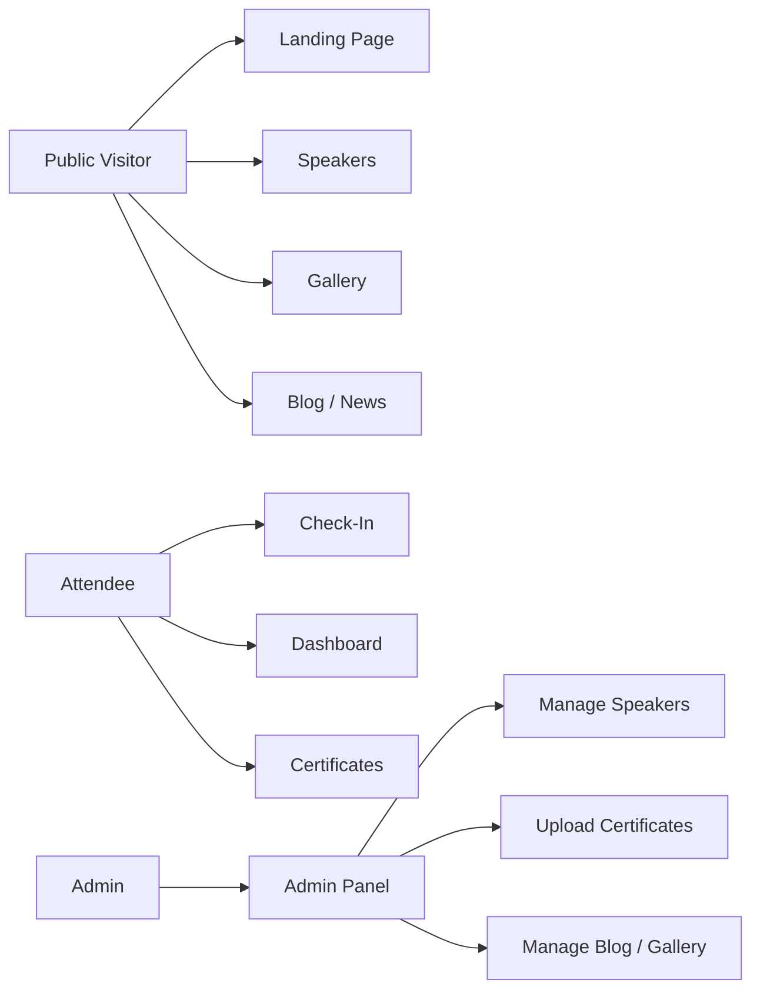

---

## 2. Product Vision & Goals

| Goal | KPI | Target |
|------|-----|--------|
| Professional TEDx brand identity | Visual audit score | Pass brand compliance |
| Increase public engagement | Avg. session duration | > 2 minutes |
| Streamline attendee experience | Check-in completion rate | > 95% |
| Enable self-service content updates | Time to publish a blog post | < 5 minutes |
| Mobile-first responsive design | Lighthouse mobile score | > 90 |
| SEO visibility | Google index coverage | 100% public pages |

---

## 3. Stakeholders & User Personas

### Persona 1: Public Visitor (Aisha, 24)
- University student in Dutse, curious about TEDx
- Lands on site from Instagram link
- Wants: event info, speaker lineup, how to attend, photos from past events
- Device: mobile phone (primary), sometimes laptop

### Persona 2: Attendee (Musa, 30)
- Registered for TEDxDutse 2025
- Scans QR at venue → check-in page → dashboard
- Wants: event schedule, speaker bios, Kahoot game, certificate download
- Device: mobile phone at event

### Persona 3: Admin / Organizer (Fatima, 28)
- TEDxDutse team lead
- Needs to update speakers, upload photos, post announcements
- Wants: simple admin panel, no code required
- Device: laptop (primary)

---

## 4. Functional Requirements

### 4.1 Public-Facing Pages

| ID | Requirement | Priority | Acceptance Criteria |
|----|-------------|----------|---------------------|
| FR-001 | Redesigned landing page | P0 | Full-width hero, video bg, theme title, CTA buttons, TEDx brand colors |
| FR-002 | About section with "What is TEDx?" boilerplate | P0 | Required TEDx legal text included verbatim |
| FR-003 | Speakers showcase section | P0 | Grid of speaker cards with photo, name, title, bio expand |
| FR-004 | Event schedule / programme | P0 | Timeline view with sessions, times, speaker names |
| FR-005 | Partners / Sponsors section | P1 | Tiered logo grid, logos smaller than TEDx logo |
| FR-006 | Photo gallery | P1 | Lightbox-enabled masonry grid, categorized by event |
| FR-007 | Video / media section | P2 | Embedded YouTube/video player grid |
| FR-008 | Blog / news section | P1 | Paginated article list, individual article pages |
| FR-009 | Contact section | P1 | Working contact form, social links, map embed |
| FR-010 | Newsletter signup | P2 | Email capture with confirmation feedback |
| FR-011 | SEO metadata on all pages | P1 | Open Graph, Twitter cards, structured data |

### 4.2 Attendee Flow

| ID | Requirement | Priority | Acceptance Criteria |
|----|-------------|----------|---------------------|
| FR-020 | Check-in form (name, phone, email) | P0 | Validates Nigerian phone format, posts to backend |
| FR-021 | Attendee dashboard (post check-in) | P0 | Shows menu: schedule, speakers, Kahoot, certificate |
| FR-022 | QR ticket scanner | P0 | Camera-based scan, verifies ticket, shows details |
| FR-023 | Certificate download portal | P1 | Search by name/email, download PDF |
| FR-024 | Order of activities page | P0 | Full event programme table |
| FR-025 | WhatsApp community link | P2 | Floating button linking to group |

### 4.3 Admin Panel

| ID | Requirement | Priority | Acceptance Criteria |
|----|-------------|----------|---------------------|
| FR-030 | Admin login (email + password) | P0 | JWT or session-based auth, protected routes |
| FR-031 | Manage speakers (CRUD) | P0 | Add/edit/delete speakers with photo upload |
| FR-032 | Manage blog posts (CRUD) | P1 | Rich text editor, publish/draft status |
| FR-033 | Upload gallery photos | P1 | Multi-file upload, categorize by event |
| FR-034 | Upload certificates (bulk) | P1 | CSV + PDF batch upload, searchable by attendee |
| FR-035 | Manage event schedule | P1 | Add/edit sessions, reorder timeline |
| FR-036 | Manage sponsors/partners | P2 | Upload logos, assign tier |
| FR-037 | View attendee list | P2 | Table with check-in status, export CSV |
| FR-038 | Site settings | P2 | Update event name, date, venue, theme, social links |

---

## 5. Non-Functional Requirements

| ID | Requirement | Target |
|----|-------------|--------|
| NFR-01 | First Contentful Paint | < 1.5s |
| NFR-02 | Lighthouse Performance score | > 85 |
| NFR-03 | Lighthouse Accessibility score | > 90 |
| NFR-04 | Mobile responsive (320px–1440px) | All pages |
| NFR-05 | Image optimization (WebP, lazy-load) | All images |
| NFR-06 | HTTPS enforced | All routes |
| NFR-07 | SEO meta tags on every page | 100% coverage |
| NFR-08 | Cross-browser support | Chrome, Firefox, Safari, Edge (latest 2) |
| NFR-09 | WCAG 2.1 AA compliance | Keyboard nav, alt text, contrast ratios |

---

## 6. System Architecture

### 6.1 High-Level Architecture

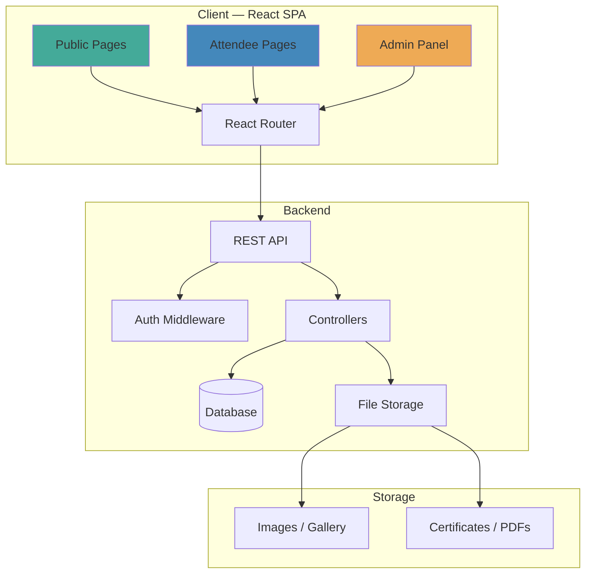

### 6.2 Tech Stack (Recommended)

| Layer | Technology | Rationale |
|-------|-----------|-----------|
| Frontend | React 19 + Vite 8 | Existing stack, team familiarity |
| Routing | React Router 7 | Already in use |
| Styling | CSS Modules or Tailwind CSS | Unified design system, no inline styles |
| State | React Context + useReducer | Lightweight, no Redux overhead |
| API | Node.js + Express **or** PHP (existing) | Match existing backend or modernize |
| Database | MySQL (existing) **or** PostgreSQL | Structured data, relations |
| Auth | JWT tokens | Stateless, works with SPA |
| File Storage | Local filesystem or S3-compatible | Speaker photos, gallery, certificates |
| Hosting | Existing PHP shared hosting or VPS | Minimize migration friction |

> **Decision needed from client:** Keep PHP backend (simpler, existing hosting) or migrate to Node.js (more flexible, better DX)? This PRD is backend-agnostic — API contracts are defined regardless.

---

## 7. Database Specification

### 7.1 Entity Relationship Diagram

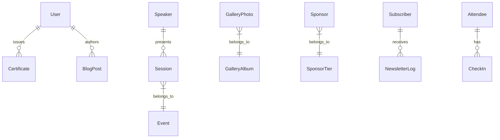

### 7.2 Table Specifications

#### `users` (Admin accounts)

| Column | Type | Constraints | Description |
|--------|------|-------------|-------------|
| id | INT | PK, AUTO_INCREMENT | Primary key |
| name | VARCHAR(100) | NOT NULL | Full name |
| email | VARCHAR(150) | UNIQUE, NOT NULL | Login email |
| password_hash | VARCHAR(255) | NOT NULL | Bcrypt hash |
| role | ENUM('admin','super_admin') | DEFAULT 'admin' | Access level |
| created_at | TIMESTAMP | DEFAULT NOW() | Account creation |

#### `speakers`

| Column | Type | Constraints | Description |
|--------|------|-------------|-------------|
| id | INT | PK, AUTO_INCREMENT | Primary key |
| name | VARCHAR(150) | NOT NULL | Full name |
| title | VARCHAR(200) | NOT NULL | Professional title / specialty |
| bio | TEXT | NOT NULL | Biography |
| photo_url | VARCHAR(500) | | Photo path |
| talk_title | VARCHAR(300) | | Title of their TEDx talk |
| talk_duration | INT | | Duration in minutes |
| session_order | INT | | Display/schedule order |
| event_year | INT | DEFAULT 2025 | Which event edition |
| is_active | BOOLEAN | DEFAULT TRUE | Show on website |
| created_at | TIMESTAMP | DEFAULT NOW() | |

#### `sessions` (Event schedule)

| Column | Type | Constraints | Description |
|--------|------|-------------|-------------|
| id | INT | PK, AUTO_INCREMENT | Primary key |
| title | VARCHAR(300) | NOT NULL | Activity title |
| description | TEXT | | Details / HTML content |
| start_time | TIME | | Session start |
| end_time | TIME | | Session end |
| segment | ENUM('morning','afternoon','evening') | | Which session block |
| session_type | ENUM('talk','performance','break','award','video','remarks') | DEFAULT 'talk' | Type of activity |
| speaker_id | INT | FK → speakers.id, NULLABLE | Linked speaker |
| event_year | INT | DEFAULT 2025 | |
| sort_order | INT | | Display order |

#### `attendees`

| Column | Type | Constraints | Description |
|--------|------|-------------|-------------|
| id | INT | PK, AUTO_INCREMENT | |
| full_name | VARCHAR(150) | NOT NULL | |
| phone | VARCHAR(20) | NOT NULL | WhatsApp number |
| email | VARCHAR(150) | | Optional |
| ticket_type | ENUM('regular','vip','vvip') | DEFAULT 'regular' | |
| reference | VARCHAR(50) | UNIQUE | QR ticket reference |
| checked_in | BOOLEAN | DEFAULT FALSE | |
| checked_in_at | TIMESTAMP | NULLABLE | |
| created_at | TIMESTAMP | DEFAULT NOW() | |

#### `certificates`

| Column | Type | Constraints | Description |
|--------|------|-------------|-------------|
| id | INT | PK, AUTO_INCREMENT | |
| attendee_id | INT | FK → attendees.id | Linked attendee |
| file_path | VARCHAR(500) | NOT NULL | PDF file location |
| certificate_code | VARCHAR(50) | UNIQUE | Verification code |
| issued_at | TIMESTAMP | DEFAULT NOW() | |
| downloaded | BOOLEAN | DEFAULT FALSE | |

#### `blog_posts`

| Column | Type | Constraints | Description |
|--------|------|-------------|-------------|
| id | INT | PK, AUTO_INCREMENT | |
| title | VARCHAR(300) | NOT NULL | |
| slug | VARCHAR(300) | UNIQUE | URL slug |
| excerpt | VARCHAR(500) | | Short preview text |
| content | TEXT | NOT NULL | Full HTML/markdown body |
| cover_image | VARCHAR(500) | | Hero image URL |
| author_id | INT | FK → users.id | |
| status | ENUM('draft','published') | DEFAULT 'draft' | |
| published_at | TIMESTAMP | NULLABLE | |
| created_at | TIMESTAMP | DEFAULT NOW() | |

#### `gallery_albums`

| Column | Type | Constraints | Description |
|--------|------|-------------|-------------|
| id | INT | PK, AUTO_INCREMENT | |
| title | VARCHAR(200) | NOT NULL | Album name |
| description | TEXT | | |
| event_year | INT | DEFAULT 2025 | |
| cover_photo | VARCHAR(500) | | Thumbnail URL |
| created_at | TIMESTAMP | DEFAULT NOW() | |

#### `gallery_photos`

| Column | Type | Constraints | Description |
|--------|------|-------------|-------------|
| id | INT | PK, AUTO_INCREMENT | |
| album_id | INT | FK → gallery_albums.id | |
| file_path | VARCHAR(500) | NOT NULL | |
| caption | VARCHAR(300) | | |
| sort_order | INT | DEFAULT 0 | |
| created_at | TIMESTAMP | DEFAULT NOW() | |

#### `sponsors`

| Column | Type | Constraints | Description |
|--------|------|-------------|-------------|
| id | INT | PK, AUTO_INCREMENT | |
| name | VARCHAR(200) | NOT NULL | Company/org name |
| logo_url | VARCHAR(500) | | Logo file path |
| website | VARCHAR(300) | | Link URL |
| tier | ENUM('presenting','platinum','gold','silver','community') | | Sponsor level |
| sort_order | INT | DEFAULT 0 | |
| event_year | INT | DEFAULT 2025 | |

#### `subscribers`

| Column | Type | Constraints | Description |
|--------|------|-------------|-------------|
| id | INT | PK, AUTO_INCREMENT | |
| email | VARCHAR(150) | UNIQUE, NOT NULL | |
| subscribed_at | TIMESTAMP | DEFAULT NOW() | |
| is_active | BOOLEAN | DEFAULT TRUE | |

---

## 8. API Reference

### 8.1 Public Endpoints

| Method | Endpoint | Description |
|--------|----------|-------------|
| GET | `/api/speakers` | List active speakers |
| GET | `/api/speakers/:id` | Single speaker detail |
| GET | `/api/schedule` | Event schedule (grouped by segment) |
| GET | `/api/sponsors` | Sponsors grouped by tier |
| GET | `/api/gallery` | Albums with cover photos |
| GET | `/api/gallery/:albumId` | Photos in album |
| GET | `/api/blog` | Paginated blog posts |
| GET | `/api/blog/:slug` | Single blog post |
| GET | `/api/settings` | Site settings (event name, date, etc.) |
| POST | `/api/subscribe` | Newsletter signup |
| POST | `/api/contact` | Contact form submission |

### 8.2 Attendee Endpoints

| Method | Endpoint | Description |
|--------|----------|-------------|
| POST | `/api/checkin` | Register / check in attendee |
| GET | `/api/me` | Current attendee session info |
| POST | `/api/verify-ticket` | Verify QR ticket reference |
| GET | `/api/certificates/search` | Search certificate by name/code |
| GET | `/api/certificates/:code/download` | Download certificate PDF |

### 8.3 Admin Endpoints (Auth Required)

| Method | Endpoint | Description |
|--------|----------|-------------|
| POST | `/api/admin/login` | Admin authentication |
| GET | `/api/admin/attendees` | List all attendees |
| GET | `/api/admin/attendees/export` | CSV export |
| POST | `/api/admin/speakers` | Create speaker |
| PUT | `/api/admin/speakers/:id` | Update speaker |
| DELETE | `/api/admin/speakers/:id` | Remove speaker |
| POST | `/api/admin/blog` | Create blog post |
| PUT | `/api/admin/blog/:id` | Update blog post |
| DELETE | `/api/admin/blog/:id` | Delete blog post |
| POST | `/api/admin/gallery/albums` | Create album |
| POST | `/api/admin/gallery/photos` | Upload photos to album |
| POST | `/api/admin/certificates/upload` | Bulk upload certificates |
| PUT | `/api/admin/settings` | Update site settings |

---

## 9. Routing & Sitemap

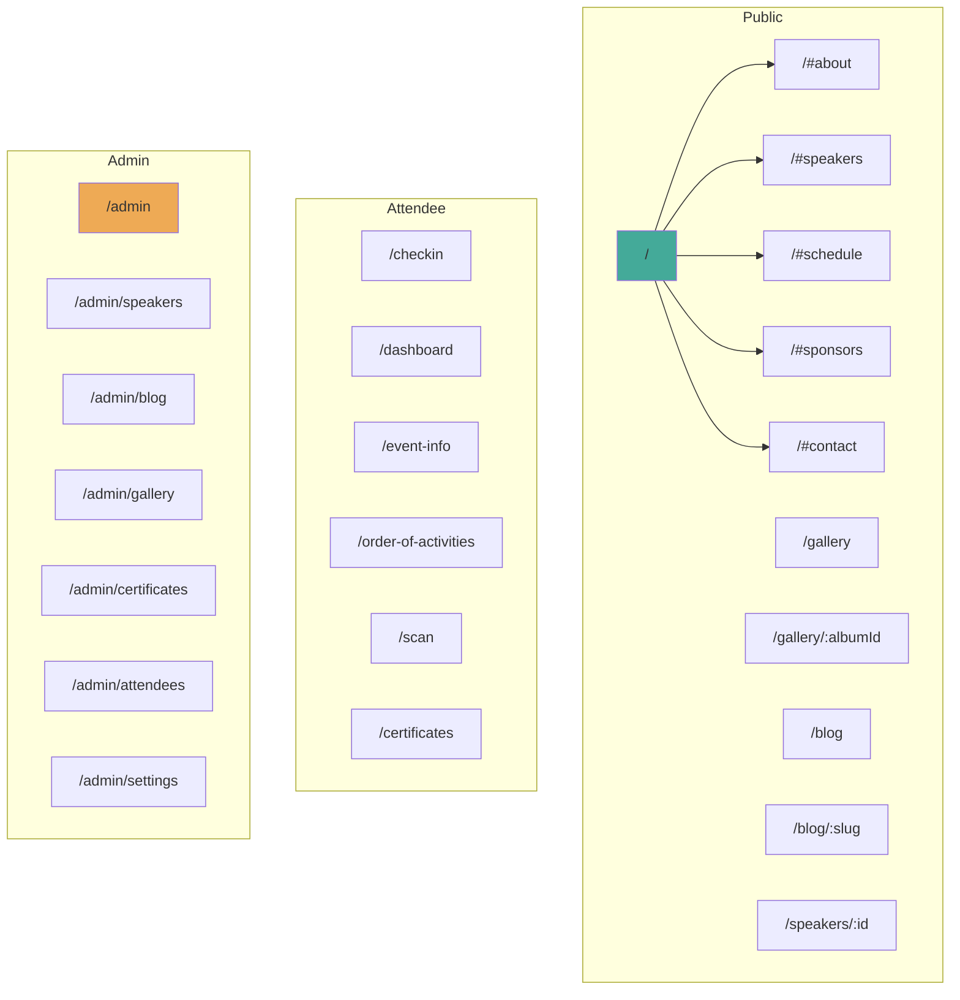

---

## 10. UI/UX Design System

### 10.1 Design Tokens

| Token | Value | Usage |
|-------|-------|-------|
| `--ted-red` | `#EB0028` | Primary brand, CTAs, accents |
| `--ted-red-dark` | `#C4001F` | Hover states |
| `--ted-red-light` | `#FF4757` | Gradients, highlights |
| `--black` | `#0A0A0A` | Backgrounds, text on light |
| `--dark` | `#111111` | Card backgrounds, sections |
| `--dark-surface` | `#1A1A1A` | Elevated cards |
| `--white` | `#FFFFFF` | Text on dark, backgrounds |
| `--gray-100` | `#F8F9FA` | Light backgrounds |
| `--gray-200` | `#E9ECEF` | Borders |
| `--gray-500` | `#6B7280` | Secondary text |
| `--gray-700` | `#374151` | Body text |
| `--gold` | `#FFD700` | Special accents (awards, highlights) |

### 10.2 Typography

| Role | Font | Weight | Size |
|------|------|--------|------|
| Headlines | Inter | 700 (Bold) | clamp(2rem, 6vw, 4rem) |
| Subheadings | Inter | 600 (Semibold) | clamp(1.25rem, 3vw, 2rem) |
| Body | Inter | 400 (Regular) | 1rem / 1.125rem |
| Captions | Inter | 400 | 0.875rem |
| Labels/UI | Inter | 500 (Medium) | 0.75rem–0.875rem |
| TEDx Logo | Inter Light | 300 | Event-specific |

### 10.3 Component Inventory

| Component | Description | Variants |
|-----------|-------------|----------|
| `Button` | CTA and action buttons | primary, secondary, ghost, danger |
| `Card` | Content container | speaker, blog, sponsor, event |
| `Navbar` | Fixed top navigation | scrolled, mobile-open |
| `Footer` | Site footer with links + newsletter | — |
| `Hero` | Full-viewport landing section | with-video, static |
| `Section` | Content wrapper with title + underline | dark, light, gray |
| `SpeakerCard` | Photo + name + title + bio expand | grid, list |
| `Timeline` | Event schedule display | morning, afternoon |
| `GalleryGrid` | Masonry photo grid with lightbox | album, all |
| `ContactForm` | Name + email + message + submit | — |
| `CertificateSearch` | Search + download interface | — |
| `AdminLayout` | Sidebar + content area | — |
| `DataTable` | Sortable, paginated table | with-export |
| `FileUpload` | Drag-and-drop multi-file | image, pdf, csv |
| `RichTextEditor` | Blog post content editor | — |
| `Toast` | Notification feedback | success, error, info |
| `Modal` | Overlay dialog | confirm, form |

### 10.4 Responsive Breakpoints

| Breakpoint | Width | Strategy |
|------------|-------|----------|
| Mobile | < 576px | Single column, stacked nav |
| Tablet | 576px–991px | 2 columns, collapsible nav |
| Desktop | 992px–1399px | 3–4 columns, full nav |
| Wide | ≥ 1400px | Max-width container, centered |

---

## 11. Data Flows

### 11.1 Attendee Check-In Flow

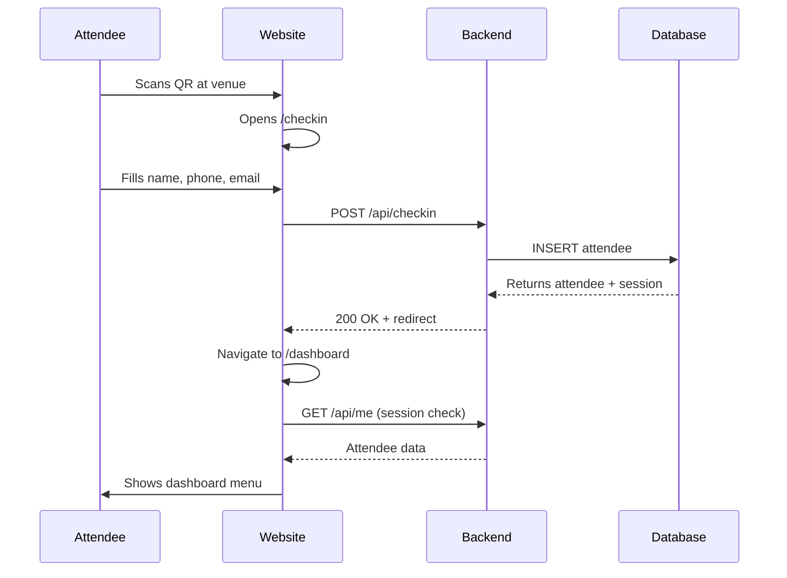

### 11.2 Certificate Verification Flow

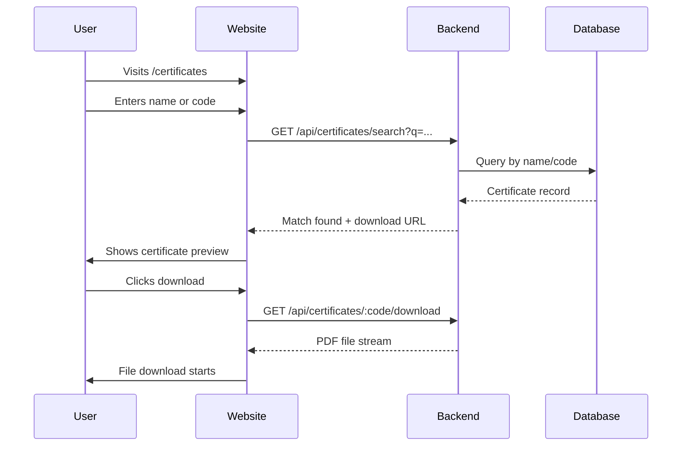

---

## 12. Module Working Flows

### 12.1 Admin Login → Dashboard

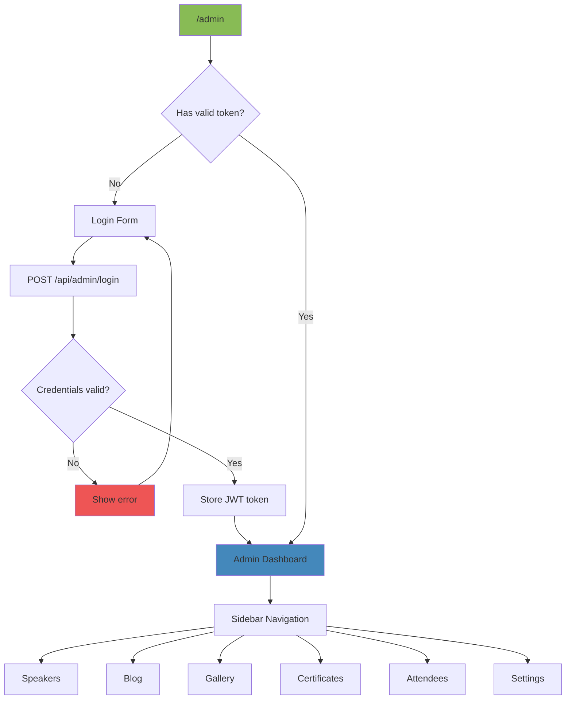

### 12.2 Gallery Upload Flow

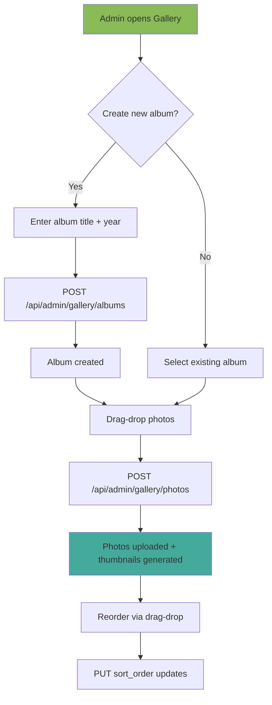

---

## 13. Security & Compliance

| Control | Implementation |
|---------|---------------|
| Authentication | JWT with 24h expiry, httpOnly cookie |
| Admin routes | Middleware checks role before access |
| File uploads | Type validation (image/pdf only), size limit 10MB |
| SQL injection | Parameterized queries / ORM |
| XSS prevention | Sanitize user input, escape HTML output |
| CSRF | Token-based for forms |
| Rate limiting | Contact form + login: 5 req/min |
| Data protection | Attendee PII stored securely, no public exposure |
| TEDx compliance | Required boilerplate text, logo rules, footer disclaimer |

### TEDx Brand Compliance Checklist

- [ ] TEDx logo uses `#EB0028` red, event name in black/white only
- [ ] Logo on solid black or white backgrounds only
- [ ] "What is TEDx?" text on homepage (verbatim from TED guidelines)
- [ ] Footer: "This independent TEDx event is operated under license from TED."
- [ ] No TED logo used anywhere (only TEDx[EventName])
- [ ] Sponsor logos smaller than TEDx logo
- [ ] Font: Inter or Helvetica only
- [ ] No ALL CAPS for event name in logo

---

## 14. Deployment Architecture

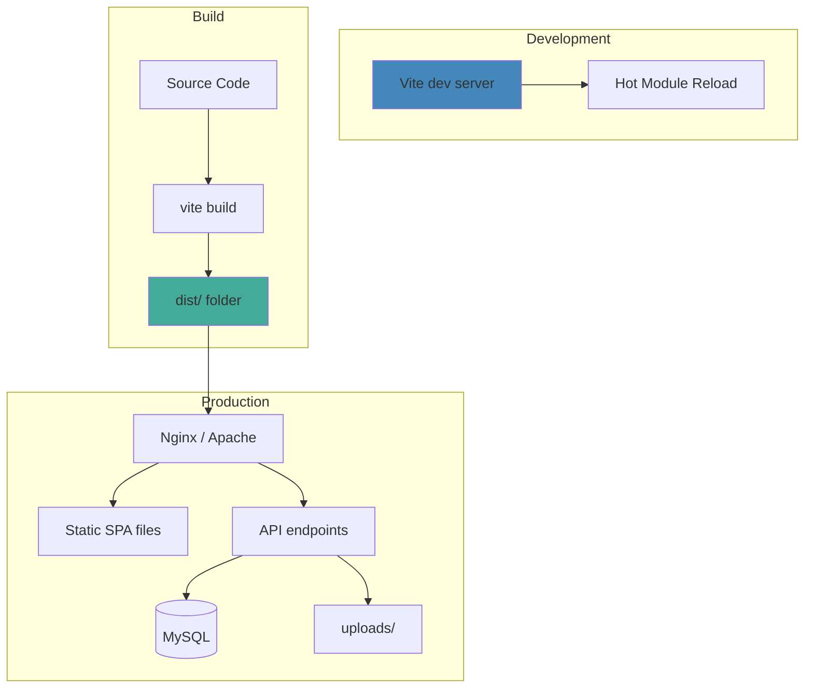

### Build & Deploy Steps

```bash
# Build
npm run build

# Deploy (copy dist/ to web root)
cp -r dist/* /path/to/public_html/tedx/

# API endpoints deployed alongside (PHP or Node)
# uploads/ directory writable by web server
```

---

## 15. Testing Strategy

| Level | Tool | Coverage Target |
|-------|------|-----------------|
| Unit | Vitest | Utility functions, data transformers |
| Component | React Testing Library | Key components (forms, cards, nav) |
| E2E | Playwright | Critical flows: check-in, certificate search, admin login |
| Visual | Percy or manual | Brand compliance across breakpoints |
| Performance | Lighthouse CI | Score thresholds in CI pipeline |
| Accessibility | axe-core | WCAG 2.1 AA on all pages |

### Key Test Scenarios

1. Check-in form validates Nigerian phone numbers correctly
2. QR scanner handles valid, invalid, and already-used tickets
3. Certificate search returns correct results by name and code
4. Admin cannot access protected routes without valid JWT
5. Gallery lightbox opens/closes, navigates between photos
6. Blog post renders with correct metadata for SEO
7. Mobile nav opens, closes, and navigates correctly
8. Contact form submits and shows confirmation

---

## 16. Implementation Roadmap

### Phase 1: Foundation & Redesign (Weeks 1–2)

- [ ] Set up project structure (components, pages, layouts, hooks)
- [ ] Implement design system (CSS variables, typography, components)
- [ ] Build shared components (Button, Card, Section, Navbar, Footer)
- [ ] Redesign landing page (hero, about, speakers, schedule, sponsors)
- [ ] Add SEO metadata to all pages
- [ ] Mobile responsive pass on all pages
- [ ] Replace favicon with TEDxDutse branded icon

### Phase 2: Content Pages (Weeks 3–4)

- [ ] Speakers page (dynamic, from API)
- [ ] Gallery page (masonry grid + lightbox)
- [ ] Blog listing + individual post pages
- [ ] Contact page with working form
- [ ] Event info page (redesigned)
- [ ] Order of activities page (redesigned)

### Phase 3: Ticket System — PHP → React (Weeks 5–6)

- [ ] Ticket purchase page (tier selector + form + Paystack integration)
- [ ] Payment verification flow (Paystack callback → auto-redirect)
- [ ] Ticket display page (QR code, status badge, share buttons)
- [ ] Ticket recovery page (email lookup)
- [ ] Admin ticket dashboard (stats, revenue, ticket list)
- [ ] Admin QR scanner page (camera-based check-in)
- [ ] Admin ticket verification (manual reference lookup)
- [ ] Admin ticket detail view (full info + mark as used)
- [ ] Backend API endpoints for all ticket operations
- [ ] QR code generation (server-side or client-side)
- [ ] Migrate existing ticket database data

### Phase 4: Attendee Features (Weeks 7–8)

- [ ] Redesign check-in flow (integrated with ticket system)
- [ ] Redesign attendee dashboard
- [ ] Certificate search & download portal
- [ ] Session-based auth for attendee area

### Phase 5: Admin Panel (Weeks 9–10)

- [ ] Admin login + protected layout (unified with ticket admin)
- [ ] Speaker management (CRUD + photo upload)
- [ ] Blog management (CRUD + rich text editor)
- [ ] Gallery management (albums + photo upload)
- [ ] Certificate bulk upload + management
- [ ] Attendee list + CSV export
- [ ] Site settings page

### Phase 6: Polish & Launch (Weeks 11–12)

- [ ] Performance optimization (lazy loading, image compression)
- [ ] Accessibility audit (WCAG 2.1 AA)
- [ ] Cross-browser testing
- [ ] TEDx brand compliance review
- [ ] Content population (real speakers, photos, sponsors)
- [ ] Retire PHP ticket system, redirect subdomain
- [ ] Deploy to production
- [ ] SEO submission to Google Search Console

---

## 17. Ticket System Module (PHP → React Conversion)

The existing ticket system lives at `tickets.tedxdutse.com/` as a standalone PHP application. It handles ticket sales, Paystack payments, QR code generation, and admin check-in. This section specifies its conversion to React and integration into the main SPA.

### 17.1 Current Architecture (PHP)

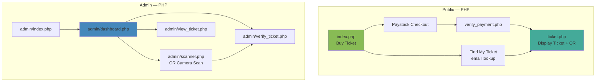

### 17.2 Ticket Types & Pricing

| Tier | Price (₦) | Perks |
|------|-----------|-------|
| Regular | 3,000 | General admission |
| VIP | 10,000 | Priority seating, networking |
| VVIP | 25,000 | Front row, speaker meet, gift bag |

### 17.3 Payment Flow (Paystack)

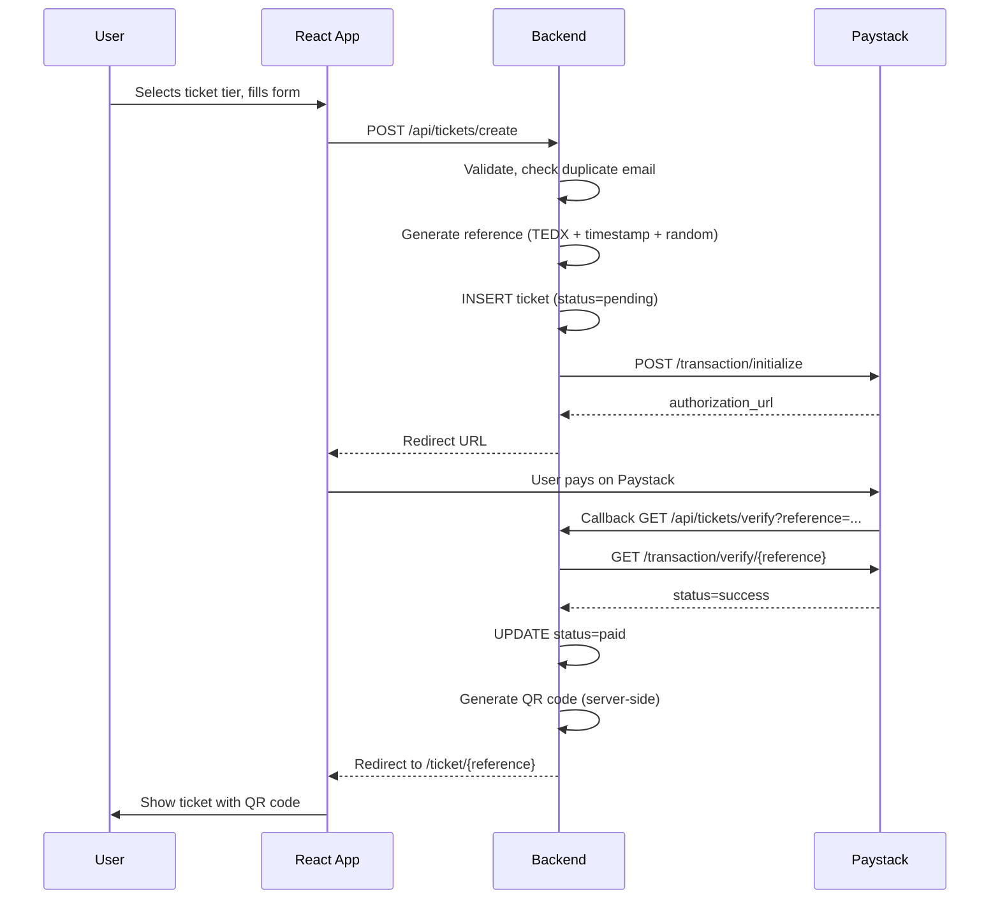

### 17.4 React Route Mapping

| PHP Route | React Route | Component |
|-----------|-------------|-----------|
| `index.php` | `/tickets` | `TicketPurchasePage` |
| `ticket.php?ref=X` | `/ticket/:reference` | `TicketDisplayPage` |
| `recover_ticket.php` | `/tickets/recover` | `TicketRecoverPage` |
| `verify_payment.php` | `/tickets/verify` | `PaymentVerifyPage` (auto-redirect) |
| `admin/index.php` | `/admin/tickets/login` | `AdminLoginPage` |
| `admin/dashboard.php` | `/admin/tickets` | `TicketAdminDashboard` |
| `admin/scanner.php` | `/admin/tickets/scanner` | `TicketScannerPage` |
| `admin/verify_ticket.php` | `/admin/tickets/verify` | `TicketVerifyPage` |
| `admin/view_ticket.php` | `/admin/tickets/:ref` | `TicketDetailPage` |

### 17.5 New API Endpoints (Ticket Module)

| Method | Endpoint | Description |
|--------|----------|-------------|
| POST | `/api/tickets/create` | Create ticket + init Paystack |
| GET | `/api/tickets/verify` | Paystack callback verification |
| GET | `/api/tickets/:reference` | Get ticket details (public) |
| POST | `/api/tickets/recover` | Find ticket by email |
| GET | `/api/admin/tickets` | List all tickets (admin) |
| GET | `/api/admin/tickets/stats` | Dashboard stats |
| POST | `/api/admin/tickets/:ref/scan` | Mark ticket as used |
| GET | `/api/admin/tickets/export` | CSV export |

### 17.6 Updated Database Schema

#### `tickets` table (replaces PHP version)

| Column | Type | Constraints | Description |
|--------|------|-------------|-------------|
| id | INT | PK, AUTO_INCREMENT | |
| ticket_type | ENUM('regular','vip','vvip') | NOT NULL | Tier |
| name | VARCHAR(150) | NOT NULL | Attendee full name |
| email | VARCHAR(150) | NOT NULL | |
| phone | VARCHAR(20) | NOT NULL | WhatsApp number |
| reference | VARCHAR(50) | UNIQUE, NOT NULL | TEDX + timestamp + random |
| amount | DECIMAL(10,2) | NOT NULL | Price in Naira |
| status | ENUM('pending','paid','used') | DEFAULT 'pending' | Lifecycle state |
| qr_code | VARCHAR(500) | NULLABLE | QR image filename |
| payment_ref | VARCHAR(100) | NULLABLE | Paystack transaction ref |
| created_at | TIMESTAMP | DEFAULT NOW() | Purchase time |
| paid_at | TIMESTAMP | NULLABLE | Payment confirmed |
| verified_at | TIMESTAMP | NULLABLE | Scanned at event |

#### Ticket Lifecycle State Machine

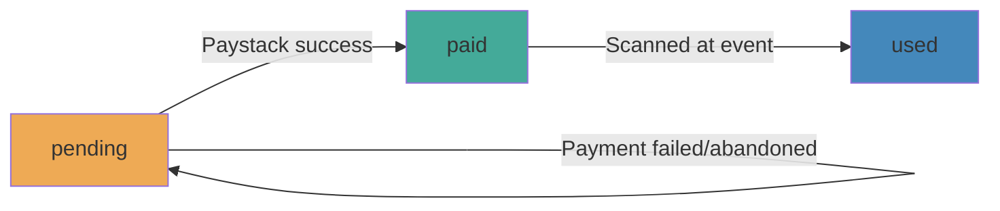

### 17.7 React Components (Ticket Module)

| Component | Description |
|-----------|-------------|
| `TicketPurchaseForm` | Name, email, phone, tier selector with prices |
| `TicketTierCard` | Visual card for each tier (Regular/VIP/VVIP) with hover effects |
| `TicketDisplay` | Full ticket view with QR code, status badge, share buttons |
| `TicketQRCode` | Renders QR code (client-side via `qrcode` npm package or server-generated image) |
| `TicketRecoveryForm` | Email input → find ticket → redirect |
| `PaymentVerify` | Auto-verifies Paystack callback, shows loading → redirect |
| `TicketAdminStats` | Dashboard stat cards (total, revenue, by tier, checked-in) |
| `TicketTable` | Paginated, searchable attendee list |
| `TicketScanner` | Camera QR scanner (html5-qrcode or react-qr-scanner) |
| `TicketScanResult` | Shows scanned ticket details + "Mark as Used" action |

### 17.8 Key Differences: PHP vs React Implementation

| Aspect | PHP (Current) | React (New) |
|--------|---------------|-------------|
| Rendering | Server-side PHP | Client-side SPA |
| Auth | PHP sessions | JWT tokens in httpOnly cookies |
| Payment | Server-side cURL to Paystack | Frontend Paystack SDK (react-paystack) |
| QR Generation | Server-side (phpqrcode) | Server-side API endpoint or client-side (qrcode npm) |
| QR Scanning | html5-qrcode (JS) | Same library, React wrapper |
| Routing | Separate PHP files | React Router nested under /tickets and /admin/tickets |
| Styling | Inline `<style>` + CSS file | Unified design system (same as main site) |
| Data | Direct MySQL queries | REST API → React state |
| Hosting | Separate subdomain | Same SPA, API routes proxied |

### 17.9 Migration Strategy

1. **Phase 1:** Build React ticket pages alongside PHP (both live)
2. **Phase 2:** Point `tickets.tedxdutse.com` to React app with redirect
3. **Phase 3:** Integrate into main site routes (`/tickets`, `/admin/tickets`)
4. **Phase 4:** Retire PHP codebase, keep DB (same schema)

### 17.10 Paystack Integration (React)

```
npm install react-paystack
```

The `react-paystack` package provides a `<PaystackButton>` component
that handles the checkout popup natively — no server-side redirect needed.
The backend still verifies the transaction server-to-server after callback.

---

## 18. Open Questions & Decisions Needed

| # | Question | Options | Impact |
|---|----------|---------|--------|
| 1 | Backend: Keep PHP or migrate to Node.js? | PHP (simpler) / Node.js (flexible) | Architecture, hosting |
| 2 | CMS: Custom admin or headless CMS? | Custom / Strapi / Sanity | Dev time, maintenance |
| 3 | Hosting: Stay on shared or move to VPS? | Shared / VPS / Vercel+API | Performance, cost |
| 4 | Photos: Are event photos available? | Yes (provide) / Need stock | Gallery content |
| 5 | Certificates: What format are they in? | PDF / Image / Need generation | Certificate portal |
| 6 | Blog: How frequently will posts be made? | Weekly / Monthly / Rarely | CMS complexity |
| 7 | Multi-year: Support past event archives? | Yes / No (current only) | Data model, UI |
| 8 | Paystack: Keep same keys or rotate? | Same / New keys | Security |
| 9 | Ticket pricing: Same for next event? | Same / Different tiers | Business logic |
| 10 | Existing ticket DB: Migrate data or fresh start? | Migrate / Fresh | Data continuity |

---

*Document prepared for TEDxDutse team. Ready for review and approval before implementation begins.*
